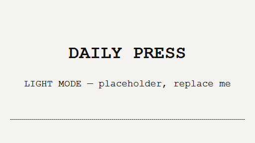
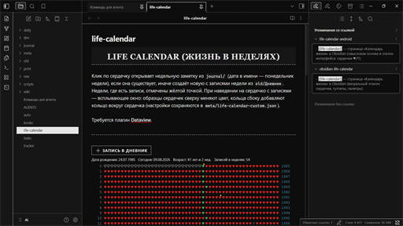

# Daily Press

A **Thermal Receipt & Newsprint Aesthetic** theme for Obsidian. The vault becomes a stack of freshly printed newspaper pages and cash-register receipts: monochrome, high-contrast, with monospace receipt typography, dashed perforation lines and sharp square edges.


## Features

- **Paper & ink palette** — off-white unbleached paper (`#F4F3EF`) with dry black pigment (`#121212`) in light mode; an inverted thermal receipt (`#0D0D0D` / `#E5E5E5`) in dark mode.
- **Receipt typography** — the whole UI, sidebars, properties and body text are set in a monospace receipt font (`Courier Prime`, `Courier New`, `Consolas`, `SF Mono`); headlines H1–H6 use a classic serif newsprint face (`Georgia`, `Times New Roman`).
- **Newsprint headlines** — H1 is an ALL CAPS front-page masthead with a dashed cut line; H2–H3 use dashed/dotted rules.
- **Perforation everywhere** — `<hr>` dividers, tab bar and callouts use dashed/dotted perforation lines; the properties block looks like the header of a receipt with double cut lines.
- **1-bit newspaper photos** — inserted images automatically become monochrome and high-contrast (`grayscale(100%) contrast(130%)`); hover restores the original colors.
- **Tags as clippings** — thin black outlines, near-transparent gray fill, ALL CAPS monospace.
- **Receipt time stamps** — wrap a time in `<time>11:02</time>` (Dataview renders dates/times into `<time>` automatically) to get a bold monospace receipt stamp.
- **Zero rounded corners** — every panel, tab, menu and button keeps `border-radius: 0`.
- **Pure CSS** — no external assets; textures and lines are built with `dashed`, `dotted` and `repeating-linear-gradient`.

## Screenshots





## Installation

### From Community themes (once published)

1. Open **Settings → Appearance → Themes**.
2. Click **Manage**, search for **Daily Press**, and **Install and use**.

### Manual

1. Download the latest release: `manifest.json` and `theme.css`.
2. Create a folder named `Daily Press` inside `<vault>/.obsidian/themes/` and place both files there.
3. In **Settings → Appearance → Themes** select **Daily Press**.

## Time stamps

Wrap a time value in an HTML tag to get the receipt stamp style:

```html
Call the client <time>11:02</time>, then grab lunch.
```

`<time>` elements rendered by Dataview queries are styled automatically.

## Support the project

This theme is free and ad-free, built in spare time. If you find it useful, you can support it in a way that works for you:

- Star the repository and share it with friends.
- Report bugs and ideas in the Issues tab.
- Optional financial support:

☕ Boosty: https://boosty.to/pws/donate

🍩 DonationAlerts: https://www.donationalerts.com/r/photowithoutstudio

**Cryptocurrency**:

- USDT (TRC20): `TRcWS42MhyFRGdGSc6LqTH8CdTy6pLUMn6`
- USDT (BEP20): `0x0905134db34d8d54abf5b60a55406821ed7b8de0`
- BTC: `17hDrZL62DBpTjK6xNCGFFG682jN9PiVF1`
- TON: `UQCzoPJlYLHSoFGmRyh_-_ox1nOMCzx3LwG79xPR5pbjs3Aq`

## Contacts

- **Telegram:** [GraphiCoreOne](https://t.me/GraphiCoreOne) — questions, feedback and ideas.

## License

MIT
